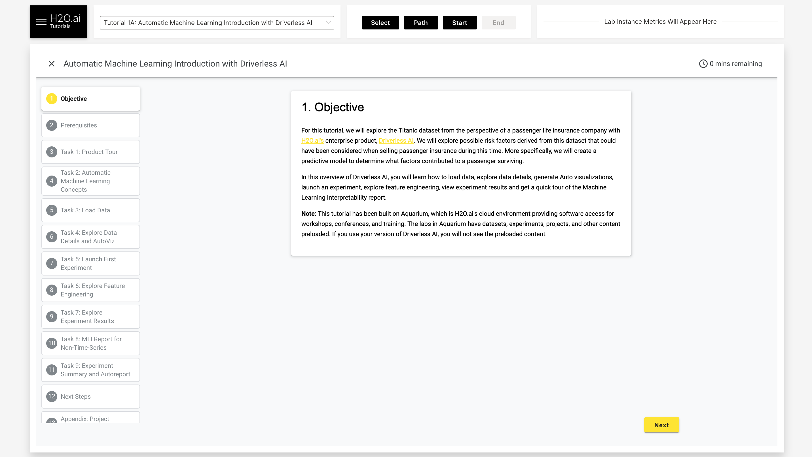
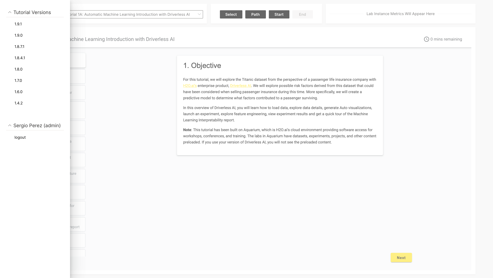

# NOTE: STILL UNDER REVIEW AND DEVELOPMENT

# Learning Center + Aquarium

A Wave app that, in essence, combines Aquarium and the H2O.ai Learning Center. As of now, users trying to learn Driverless AI will be required to have a Learning Center account to access Driverless AI tutorials. The Driverless AI tutorial as a pre-requisite requires users to obtain an Aquarium account to obtain access to Driverless AI lab instances to complete a tutorial. Therefore, this quickly becomes a problem because it forces users to have two accounts and makes the learning process painful and lengthy.

This Wave app will only require users to create an Aquarium account through the wave app, and when users access it, they will be presented with all Driverless AI tutorials and the ability to start any Aquarium lab all in one single centralized platform.

In contrast to the Learning Center, where only a particular version of Driverless AI tutorials is visible, this wave app will give users access to all past versions of Driverless AI tutorials and Aquarium lab instances(e.g., Turorial 1A 1.9.0 with Aquarium lab 1.9.0). 

# Views:

Main view: 



Navigation: 




# Setup

### Step 1: Download the H2O Wave SDK for your platform.

[Download the H2O Wave SDK](https://github.com/h2oai/wave/releases/latest) for your platform.

### Step 2: Extract

Extract your download.

```
tar -xzf wave-x.y.z-linux-amd64.tar.gz
```

### Step 3: Move

Move it to a convenient location, say $HOME/wave/.

```
 mv wave-x.y.z-linux-amd64 $HOME/wave
 ```
 
### Step 4: Run

Go to your Wave directory.

```
cd $HOME/wave
```

Start the Wave server.

```
./waved
```

```
2020/10/27 16:16:34 # 
2020/10/27 16:16:34 # ┌─────────────────────────┐
2020/10/27 16:16:34 # │  ┌    ┌ ┌──┐ ┌  ┌ ┌──┐  │ H2O Wave
2020/10/27 16:16:34 # │  │ ┌──┘ │──│ │  │ └┐    │ (version) (build)
2020/10/27 16:16:34 # │  └─┘    ┘  ┘ └──┘  └─┘  │ © 2020 H2O.ai, Inc.
2020/10/27 16:16:34 # └─────────────────────────┘
2020/10/27 16:16:34 # 
2020/10/27 16:16:34 # {"address":":10101","t":"listen","webroot":"/home/elp/wave/www"}
```

### Step 5: Verify

Finally, point your web browser to http://localhost:10101/. You should see an empty page with a blinker that says: Wave: Live. 


### Step 6: Run the Aquarium Wave app 

Rename your `learning_center-master` (download) to `learning center`. 

Move it to a convenient location, say $HOME/learning_center/. First, create a folder name learning_center in your home directory. Rigth after, in a new terminal: Create a virtual environment and install the Learning Center's dependencies.

```
cd $HOME/learning_center
python3 -m venv venv
source venv/bin/activate
pip install -r requirements.txt
pip install requests
```

Finally, run the Learning Center inside the learning_center folder:

```
wave run learning_center 
```

Go to http://localhost:10101/learning_center to access the Learning Center.


